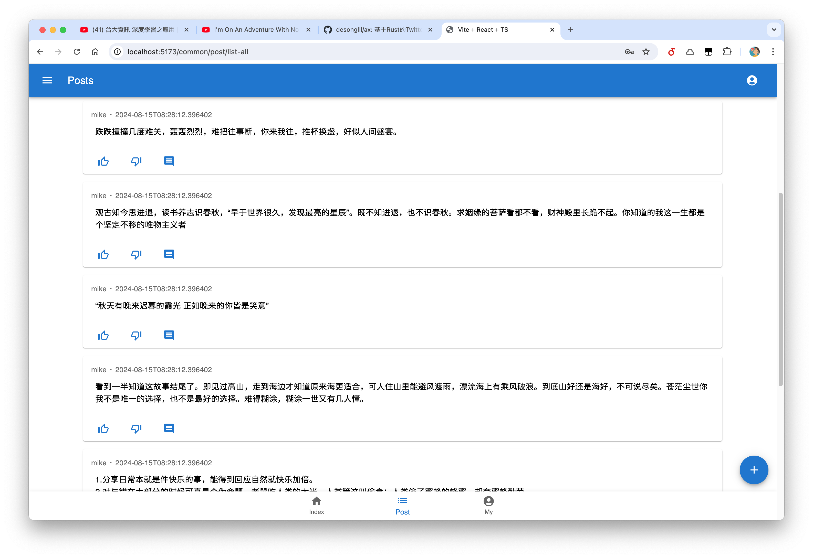
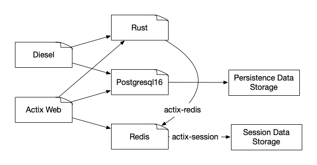

## !!! This README is not updated for sqlx.

## !!! This README is not updated for distribute system.

## Apps

A Chat And Post System based on Rust and Postgres.


The previous project was [Crab Rocket](https://github.com/desonglll/crab_rocket)

- [!!! This README is not updated for sqlx.](#-this-readme-is-not-updated-for-sqlx)
- [!!! This README is not updated for distribute system.](#-this-readme-is-not-updated-for-distribute-system)
- [Apps](#apps)
- [🧩 Project Dependencies](#-project-dependencies)
- [Demo](#demo)
- [⚙️ Requirements](#️-requirements)
    - [Rust](#rust)
    - [Postgres](#postgres)
    - [Redis](#redis)
    - [diesel](#diesel)
- [🎃 Quick Start](#-quick-start)
- [Migrations](#migrations)
    - [Create a .env file](#create-a-env-file)
    - [Run sqlx-cli](#run-sqlx-cli)
    - [Run server](#run-server)
- [🔧 Compile Release Version](#-compile-release-version)
    - [Installation](#installation)
    - [🚀 Running the Binary](#-running-the-binary)
    - [Reset Database](#reset-database)
    - [Run](#run)
- [Design](#design)
    - [Technical](#technical)

## 🧩 Project Dependencies

- Rust
- Postgresql16
- Redis
- Actix-Web

## Demo



## ⚙️ Requirements

### Rust

```sh
curl --proto '=https' --tlsv1.2 -sSf https://sh.rustup.rs | sh
```

### Postgres

```sh
brew install postgresql@16
```

### Redis

```sh
brew install redis
```

## 🎃 Quick Start

```shell
# make sure you are in root directory of project.
cp .env.example .env
sudo chmod 777 ./scripts/init_db.sh
./scripts/init_db.sh
```

docker run redis service.

[//]: # (## Migrations)

[//]: # ()

[//]: # (<!-- https://crates.io/crates/sqlx-cli -->)

[//]: # ()

[//]: # (### Run sqlx-cli)

[//]: # ()

[//]: # (```shell)

[//]: # (brew install sqlx-cli)

[//]: # (source .env)

[//]: # ()

[//]: # (cd tweet_server)

[//]: # ()

[//]: # (sqlx database create)

[//]: # (sqlx database drop)

[//]: # ()

[//]: # (# Creates a new file in `migrations/<timestamp>-<name>.sql`.)

[//]: # (# Add your database schema changes to this new file.)

[//]: # (sqlx migrate add -r <name>)

[//]: # ()

[//]: # (sqlx migrate run)

[//]: # ()

[//]: # (sqlx migrate info --source ../relative/migrations)

[//]: # ()

[//]: # (sqlx migrate revert)

[//]: # (```)

[//]: # ()

[//]: # (### Start Recommend Model using Machine Learning)

[//]: # ()

[//]: # (Run this project.)

[//]: # ()

[//]: # (See [ax-recommend-model]&#40;https://github.com/desonglll/ax-recommend-model&#41;)

[//]: # ()

[//]: # (### Run server)

[//]: # ()

[//]: # (```shell)

[//]: # (# Run the server)

[//]: # (cd ax)

[//]: # (cargo run --bin tweet_service)

[//]: # (```)

## 🔧 Compile Release Version

```shell
cargo build --release
```

[//]: # (### Installation)

[//]: # ()

[//]: # (```shell)

[//]: # (cargo install --path .)

[//]: # (```)

[//]: # ()

[//]: # (### 🚀 Running the Binary)

[//]: # ()

[//]: # (Set the environment variable:)

[//]: # ()

[//]: # (```shell)

[//]: # (export DATABASE_URL=postgres://@localhost/hello_rocket)

[//]: # (```)

[//]: # ()

[//]: # (Alternatively, update the `.env` file in the project root.)

[//]: # ()

[//]: # (### Run)

[//]: # ()

[//]: # (```shell)

[//]: # (ax)

[//]: # (```)

## Design

### Technical

 